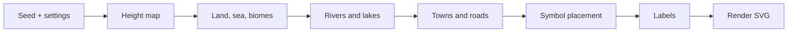
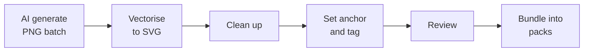
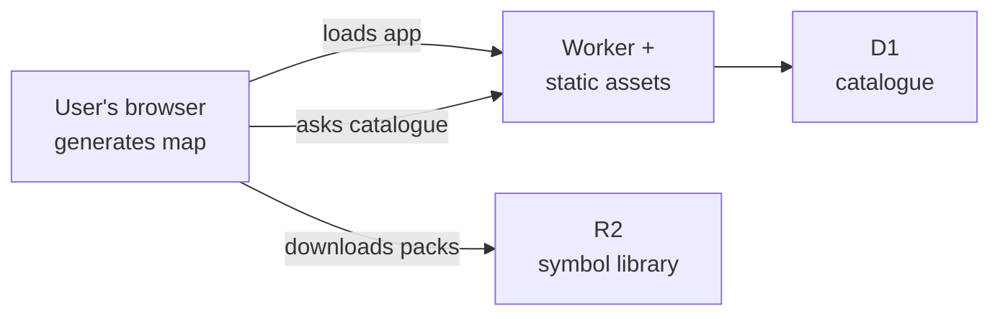

# Ink Fantasy Map Generator: Phased Spec

Sep 23, 2026 · @Someone

## Overview and goals

A free, public web app that procedurally generates fantasy maps in a black-and-white, hand-inked style, hosted on Cloudflare and built with Claude Code.

The style is pen-and-ink fantasy cartography: hatched mountains, stippled riverbanks, side-on trees and towns, heraldic emblems and serif lettering. The look is inspired by 16th and 17th century engraved maps.

**Audience:** tabletop gamers, writers and hobbyists who want a usable map in minutes without drawing skills.

**Success criteria:**

- A user can generate a finished region map in under 10 seconds from pressing Generate.
- The same seed always produces the same map, so maps can be shared as a short code.
- Exported maps are sharp enough to print at A3.
- The symbol library looks consistent, as if one illustrator drew every symbol.
- Running cost stays near zero per map, so the tool can remain free.

## Scope and phases

The app ships in four phases. Region maps come first because they are the core of the style and share an engine with world maps.

| Phase | Map scale | Engine | Symbol sets needed |
| --- | --- | --- | --- |
| 1 | Region | Terrain engine | Mountains, hills, forests, rivers, roads, villages, towns, bridges, landmarks, emblems |
| 2 | World / continent | Terrain engine, zoomed out | Mountain ranges, coastlines, compass rose, sea creatures, capitals |
| 3 | Town / city | Settlement engine (new) | Buildings, walls, gates, towers, fields, docks |
| 4 | Dungeon / building | Floor-plan engine (new) | Walls, doors, stairs, furniture, hazards |

**In scope for Phase 1:** generation, symbol library, labels, light editing, SVG and PNG export, share by seed.

**Out of scope for Phase 1:** user accounts, saved map galleries, colour styles, print PDF, collaborative editing.

Phases 3 and 4 are effectively separate generators that share the style, the symbol library and the user interface. They should not start until Phase 1 is stable.

## How the generator works

The generator is a pipeline of stages, each taking the previous stage's output, like packets passing through a chain of network functions.



Each stage runs in order and only reads what earlier stages produced.

1. **Seed and settings.** A seed is a number that drives every random choice. The same seed and settings always produce the same map, like a config template plus variables giving identical output every time.
2. **Height map.** "Noise" (smooth, natural-looking randomness) gives every point an elevation, forming hills, valleys and peaks.
3. **Land, sea and biomes.** Anything below a set height becomes water. Elevation and moisture decide forest, grassland, marsh or mountain.
4. **Rivers and lakes.** Rivers start high and always flow downhill to the sea, like traffic following the lowest-cost route. Water that cannot escape pools into a lake.
5. **Towns and roads.** Towns are placed on good sites, such as river crossings and flat ground near water. Roads connect them along the easiest path, avoiding steep ground.
6. **Symbol placement.** The app stamps symbols from the library onto the map: mountain drawings on high ground, clusters of trees in forests. Random rotation, size and flipping stop it looking repetitive.
7. **Labels.** Names are generated and placed so they do not overlap symbols or each other.
8. **Render.** Everything is drawn as SVG line art, ready to view, edit or export.

The world map reuses stages 2 to 7 at a larger scale. The town and dungeon engines replace stages 2 to 5 with their own rules.

## Symbol library and asset pipeline

Symbols are AI-generated, converted to SVG and cleaned up before entering the library. The target is 300 to 500 high-quality symbols for Phase 1, which read as thousands once varied by the generator.



1. **Generate.** Use one fixed style prompt and one reference image for every batch. Symbols are drawn in black ink on a plain white background, one symbol per image.
2. **Vectorise.** Convert each PNG to SVG with a tracing tool such as vtracer or potrace. SVG stores the drawing as line instructions, like a running config, rather than a photo of the output.
3. **Clean up.** Remove stray marks, merge broken lines and even out line thickness. A script handles the bulk of this; a person fixes the rest.
4. **Anchor and tag.** Set the point where the symbol meets the ground, such as the base of a tree trunk. Tag it with category, scale, size and variant.
5. **Review.** Each symbol is checked against the style guide before approval. Rejects go back to step 1.
6. **Bundle.** Approved symbols are grouped into packs per category (for example, "region-trees"). The browser downloads a few packs instead of hundreds of single files.

**Style guide rules for every symbol:**

- Pure black on transparent, no grey fills.
- Light source from the top left, so hatching sits on the right-hand slopes.
- Consistent outline weight at the default map scale.
- Side-on (profile) view for terrain and buildings.

**Licensing:** confirm the chosen AI image tool's terms allow the output to be redistributed publicly. Record the tool and date for each batch.

## Architecture on Cloudflare

Map generation runs entirely in the user's browser. Cloudflare only serves the app, the symbol packs and the catalogue, so each map costs almost nothing to produce.



| Component | Cloudflare service | Job | Networking analogy |
| --- | --- | --- | --- |
| App front end | Workers static assets | Serves the web page and generator code | The web server behind a load balancer |
| Generator | Runs in the browser | Builds the map from the seed | Processing at the edge device instead of hauling traffic to the core |
| Symbol library | R2 object storage | Holds SVG symbol packs | A file server or CDN origin |
| Catalogue | D1 database | Lists every symbol with its tags | An IPAM or CMDB for symbols |
| Catalogue API | Worker | Answers "which symbols suit a region forest?" | A DNS resolver answering lookups |

**Why R2:** R2 has no egress (download) fees, which matters for a free public tool serving large files.

**Caching:** symbol packs are versioned (for example, `region-trees-v3`) and cached for a long time. A new version gets a new name, like bumping a firmware image version rather than overwriting it.

**Admin area:** a password-protected page, behind Cloudflare Access, for uploading and approving symbols.

## Data model

Two structures matter: the symbol catalogue, which lives in D1, and the map settings, which live only in the share code.

**Symbol catalogue (one row per symbol):**

| Field | Example | Purpose |
| --- | --- | --- |
| id | `tree-conifer-012` | Unique name |
| category | tree | What it is |
| subtype | conifer | Finer grouping |
| scales | region, world | Which map types can use it |
| width\_px, height\_px | 48, 96 | Size at default scale |
| anchor\_x, anchor\_y | 24, 94 | Where it meets the ground |
| pack | region-trees-v3 | Which bundle holds it |
| status | approved | draft, approved or rejected |
| source\_tool | (AI tool name) | Licensing record |
| created | 2026-09-23 | Date added |

**Map settings (the share code):**

```json
{
  "v": 1,
  "scale": "region",
  "seed": 482913,
  "width": 1600,
  "height": 2400,
  "sea_level": 0.35,
  "forest_density": 0.6,
  "town_count": 5
}
```

The settings are compressed into a short code in the URL. Opening the URL rebuilds the identical map, so no maps are stored on the server. The `v` field is the generator version, so older links keep working after the generator changes.

## Features and acceptance criteria

Each phase is done when every item in its checklist passes.

**Phase 1: Region maps**

- [ ] Generate button produces a region map in under 10 seconds on a mid-range laptop.
- [ ] Settings panel: seed, size, sea level, forest density, mountain density, number of towns.
- [ ] Rivers always flow downhill and end at the sea or a lake.
- [ ] Roads connect every town; no road crosses a river without a bridge symbol.
- [ ] No two symbols overlap by more than 20% of their area.
- [ ] Labels never overlap symbols or other labels.
- [ ] Light editing: move, delete or swap a symbol; rename, move or delete a label.
- [ ] Export as SVG and as PNG at screen and 300 dpi A3 sizes.
- [ ] Share link rebuilds the identical map in another browser.
- [ ] Works on desktop and tablet; phone can view and export.

**Phase 2: World maps**

- [ ] Coastlines, continents and island chains at world scale.
- [ ] Mountain ranges drawn as chains of symbols rather than scattered peaks.
- [ ] Compass rose, border decoration and title cartouche options.
- [ ] Zoom from a world map into a region map generated from the same seed.

**Phase 3: Town and city maps**

- [ ] Street network, walls, gates and districts.
- [ ] Buildings sized and placed along streets without overlap.
- [ ] Optional river, harbour and castle.

**Phase 4: Dungeon and building maps**

- [ ] Rooms and corridors connected so every room is reachable.
- [ ] Doors, stairs, furniture and hazard symbols placed by room type.
- [ ] Optional square grid overlay for tabletop use.

## Non-functional requirements

These apply to every phase.

| Area | Requirement |
| --- | --- |
| Performance | First page load under 3 seconds on broadband; symbol packs load in the background |
| Cost | Stay within Cloudflare's free or lowest paid tier at 10,000 maps per month |
| Browsers | Current Chrome, Edge, Firefox and Safari |
| Accessibility | All controls usable by keyboard; text meets contrast guidelines |
| Privacy | No accounts, no tracking cookies, no personal data stored |
| Abuse | Rate limiting on the catalogue API |
| Licensing | Every symbol records its source tool; AI tool terms checked for public redistribution |
| Code quality | Each pipeline stage is a separate module with its own tests |
| Determinism | Tests confirm a fixed seed gives an identical map on every run |

## Open questions and working defaults

The build proceeds on these defaults unless a decision changes them.

| Question | Working default |
| --- | --- |
| Which AI image tool generates the symbols? | Not yet chosen; must allow public redistribution |
| Export formats | SVG and PNG in Phase 1; print PDF later |
| Editing depth | Generate, then light edits (move, delete, swap, relabel) |
| User accounts | None; maps shared by seed code in the URL |
| Domain and app name | Not yet chosen |
| Name generation | Built-in generator of fantasy-style place names; user can override |
| Colour styles | Black and white only; parchment and colour tints later |
| Build on Azgaar's open-source generator or start fresh? | Start fresh, using Azgaar and Watabou's Perilous Shores as reference only |

## Build order for Claude Code

Hand Claude Code one milestone at a time, with this spec attached. Each milestone ends with something visible to test before moving on.

| # | Milestone | What you can see when it is done |
| --- | --- | --- |
| 1 | Project skeleton on Cloudflare | A blank page live at the chosen address |
| 2 | Height map and land/sea | A grey-shaded terrain image that changes with the seed |
| 3 | Rivers and lakes | Blue debug lines flowing downhill |
| 4 | Placeholder symbols | Simple triangles for mountains and circles for trees |
| 5 | Towns and roads | Dots for towns joined by dashed roads |
| 6 | Asset pipeline script | A folder of traced, cleaned SVGs from a test batch |
| 7 | Catalogue and packs (D1, R2) | Real ink symbols replace the placeholders |
| 8 | Labels and emblems | Named towns and regions without overlaps |
| 9 | Editing and export | Move a symbol, then download SVG and PNG |
| 10 | Share links and polish | A link that rebuilds the same map elsewhere |

**How to hand over each milestone:**

- Start the Claude Code session with: the spec, the milestone number, and "stop and show me when this milestone is done".
- Ask Claude Code to explain what each new file does in plain English before moving on.
- Keep the placeholder symbols until milestone 7. This separates "is the map logic right?" from "does the art look right?", like testing routing with loopbacks before cabling real devices.
- Run the asset pipeline (milestone 6) in parallel with milestones 2 to 5, since generating and cleaning symbols takes the longest.

## Glossary

| Term | Plain-English meaning |
| --- | --- |
| Anchor point | The spot on a symbol that sits on the ground, such as the base of a tree |
| Biome | A type of land: forest, grassland, marsh, mountain |
| D1 | Cloudflare's database, used here as the symbol catalogue |
| Deterministic | Same input always gives the same output |
| Hatching | Parallel lines used to shade one side of a shape |
| Height map | A grid of elevation values for every point on the map |
| Noise | Smooth randomness that looks natural, used to make terrain |
| Pack | A bundle of related symbols downloaded as one file |
| Procedural generation | Creating content from rules and randomness instead of drawing it by hand |
| R2 | Cloudflare's file storage, used here for symbol packs |
| Seed | The number that drives every random choice in a map |
| Stippling | Dots used for texture, such as riverbanks and sand |
| SVG | An image format stored as drawing instructions, so it stays sharp at any size |
| Vectorise | Converting a pixel image into SVG line instructions |
| Worker | A small program running on Cloudflare's network |
